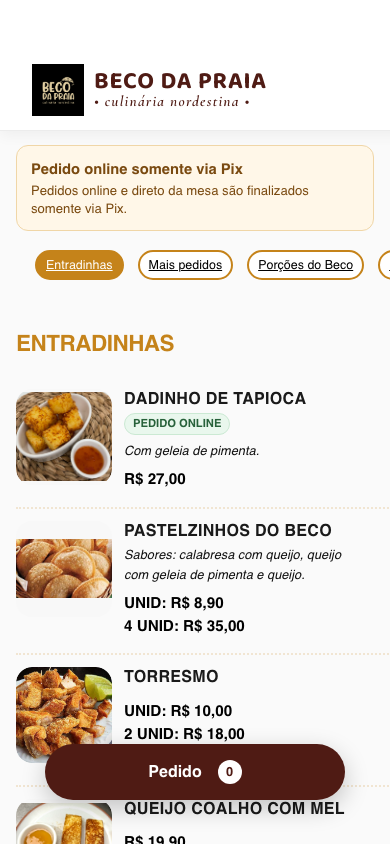
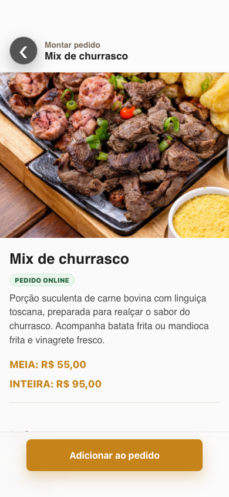
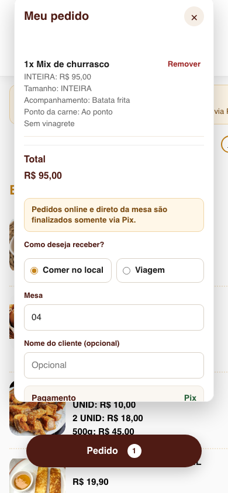
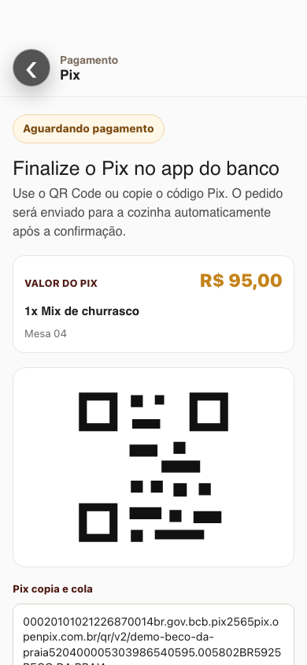
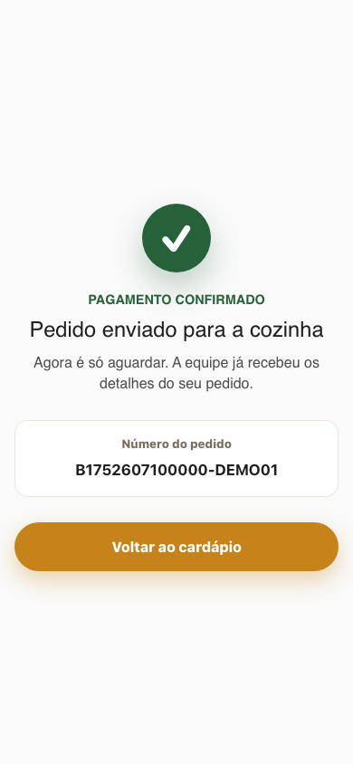

# Beco da Praia Menu

Cardapio online do Beco da Praia com fluxo de pedidos direto da mesa, backend serverless em Java/Quarkus e impressao local na cozinha via Raspberry Pi.

## Objetivo

O projeto partiu de um cardapio web estatico acessado pelo `index.html`. A feature atual mantem a navegacao do cardapio e adiciona a montagem do pedido online, com variacoes obrigatorias, observacoes e envio para a cozinha.

O foco inicial da experiencia e mobile. A tela de detalhe do item abre como uma nova tela do fluxo, com botao voltar, em vez de modal, para reduzir friccao em celulares.

## Stack

- Frontend estatico: `index.html`, `style.css`, `orders.js` e `config.js`.
- Backend local/serverless: Java 17 com Quarkus.
- Empacotamento: Maven multi-modulo.
- Deploy AWS: AWS SAM usando `template.yaml`.
- Processamento: AWS Lambda com Quarkus Amazon Lambda HTTP.
- API publica: Amazon API Gateway HTTP API.
- Banco de dados: Amazon DynamoDB.
- Fila/evento de impressao: AWS IoT Core.
- Agente local: Java 17 em Raspberry Pi.
- Impressora: ESC/POS via TCP/IP na rede Wi-Fi do restaurante.

Nao fazem parte da arquitetura atual:

- Node.js como runtime de backend.
- Docker/container.
- Kubernetes.

## Arquitetura

```text
Cliente no celular
  -> Cardapio web estatico
  -> API Gateway HTTP API
  -> Lambda Java/Quarkus
  -> DynamoDB
  -> AWS IoT Core
  -> Raspberry Pi no restaurante
  -> Impressora ESC/POS da cozinha
```

### Fluxo de pedido

1. O cliente acessa o cardapio pelo celular.
2. Escolhe um item do cardapio.
3. A aplicacao abre a tela de detalhe do item.
4. O cliente informa quantidade, variacoes obrigatorias e observacoes.
5. O item e adicionado ao carrinho.
6. O cliente escolhe se vai comer no local ou levar para viagem.
7. Para comer no local, informa a mesa. Para viagem, informa o nome para retirada.
8. O frontend envia o pedido para `POST /orders` com pagamento Pix.
9. O backend cria uma cobranca dinamica na OpenPix/Woovi e retorna QR Code/copia-e-cola.
10. O webhook da OpenPix/Woovi confirma o pagamento e libera a impressao.
11. O Raspberry Pi recebe a mensagem e imprime na cozinha.

### Fluxo visual do pedido

Os prints abaixo usam dados mockados para demonstrar o fluxo mobile de pedido e pagamento Pix.

| Etapa | Print |
| --- | --- |
| Cardapio |  |
| Detalhe do item |  |
| Carrinho |  |
| Pagamento Pix |  |
| Pix copiado |  |
| Sucesso |  |

## Regras de cardapio

O fluxo de pedido respeita regras especificas para evitar pedidos incompletos:

- Alguns itens temporariamente removidos do cardapio online nao aparecem para pedido.
- Nas entradinhas, apenas Dadinho de tapioca, Batata frita e Caldinho de feijao estao disponiveis para pedido direto da mesa.
- Itens indisponiveis aparecem sem botao de adicionar ao pedido.
- Itens disponiveis para compra exibem a tag visual `Pedido online`.
- Pedidos online e direto da mesa aceitam somente pagamento via Pix.
- Pedido para comer no local exige mesa; pedido para viagem exige nome para retirada.
- Pratos com carne exigem escolha do ponto quando necessario: ao ponto, bem passado ou mal passado.
- Arrumadinho e Panelinha de Lingua nao exigem ponto da carne.
- Porcoes com preco meia/inteira exigem escolha do tamanho antes de adicionar ao carrinho.
- Opcoes e observacoes sao enviadas ao backend e impressas junto do item para reduzir erro operacional.

## Estrutura do projeto

```text
.
|-- index.html
|-- style.css
|-- orders.js
|-- config.js
|-- cardapio.md
|-- template.yaml
|-- RASPBERRY_PI_SETUP.md
|-- backend/
|   |-- pom.xml
|   `-- src/
`-- printer-agent/
    |-- pom.xml
    `-- src/
```

### Frontend

- `index.html`: estrutura do cardapio e carregamento dos scripts.
- `style.css`: layout mobile-first, carrinho e tela de detalhe do produto.
- `orders.js`: carrinho, regras de variacao, validacao do pedido e envio para API.
- `config.js`: configuracao da URL da API de pedidos.
- `cardapio.md`: referencia textual do cardapio.

Por padrao, o frontend envia pedidos para `/orders` no mesmo dominio.

Para usar uma API Gateway externa, configure `config.js`:

```js
window.BECO_ORDERS_API_BASE_URL = 'https://sua-api.execute-api.regiao.amazonaws.com';
```

### Backend

Modulo: `backend/`

Responsabilidades:

- Receber pedidos.
- Validar campos obrigatorios.
- Rejeitar pedidos online com forma de pagamento diferente de Pix.
- Validar se o pedido e para comer no local ou viagem.
- Validar itens e opcoes do pedido.
- Persistir pedido no DynamoDB.
- Publicar evento de impressao no AWS IoT Core.
- Permitir consulta, reimpressao e atualizacao de status de impressao.

Endpoints:

- `POST /orders`: cria pedido.
- `GET /orders/{orderId}`: consulta pedido.
- `POST /orders/{orderId}/reprint`: republica pedido para impressao.
- `POST /orders/{orderId}/print-status`: atualiza status de impressao.
- `POST /payments/openpix/webhook`: recebe eventos de pagamento Pix.

Variaveis de ambiente:

- `ORDERS_TABLE`: tabela DynamoDB de pedidos.
- `PRINTER_ORDERS_TOPIC`: topico IoT usado pela cozinha.
- `IOT_DATA_ENDPOINT`: endpoint data plane do AWS IoT Core.
- `OPENPIX_BASE_URL`: URL da OpenPix/Woovi.
- `OPENPIX_APP_ID`: credencial da aplicacao OpenPix/Woovi.
- `OPENPIX_WEBHOOK_TOKEN`: token compartilhado para proteger o webhook Pix.
- `PIX_CHARGE_EXPIRES_IN_SECONDS`: tempo de expiracao da cobranca Pix.

Status principais:

- `PAYMENT_PENDING`: pedido Pix criado e aguardando pagamento.
- `PAID`: Pix confirmado pelo webhook.
- `PRINT_REQUESTED`: pedido enviado para impressao.
- `PRINTED`: agente confirmou impressao.
- `PRINT_FAILED`: agente falhou ao imprimir.
- `PAYMENT_EXPIRED`: cobranca Pix expirou.

### Printer Agent

Modulo: `printer-agent/`

Responsabilidades:

- Rodar no Raspberry Pi dentro da rede Wi-Fi do restaurante.
- Conectar ao AWS IoT Core com certificado X.509.
- Assinar o topico de pedidos da cozinha.
- Converter o pedido em texto ESC/POS.
- Imprimir item, quantidade, variacoes e observacoes na impressora da cozinha.

Topico padrao:

```text
beco/printer/kitchen/orders
```

Configuracoes principais:

- `AWS_IOT_ENDPOINT`
- `AWS_IOT_CLIENT_ID`
- `AWS_IOT_CERT_PATH`
- `AWS_IOT_PRIVATE_KEY_PATH`
- `AWS_IOT_TOPIC`
- `PRINTER_HOST`
- `PRINTER_PORT`

O passo a passo do Raspberry Pi esta em `RASPBERRY_PI_SETUP.md`.

## AWS SAM

O arquivo `template.yaml` define:

- `AWS::Serverless::HttpApi` para expor os endpoints.
- `AWS::Serverless::Function` Java 17 arm64 para o backend Quarkus.
- `AWS::DynamoDB::Table` com billing `PAY_PER_REQUEST`.
- Permissoes da Lambda para DynamoDB e `iot:Publish`.
- Rota de webhook `/payments/openpix/webhook` para confirmacao do Pix.

Outputs principais:

- `OrdersApiUrl`
- `OrdersTableName`
- `PrinterOrdersTopic`
- `OpenPixWebhookUrl`

## Build e testes

Rodar todos os testes:

```bash
./mvnw test
```

Validar os scripts do frontend:

```bash
node --check orders.js
node --check config.js
```

Gerar os artefatos:

```bash
./mvnw -DskipTests package
```

Artefatos esperados:

- `backend/target/function.zip`
- `printer-agent/target/beco-printer-agent-1.0.0-SNAPSHOT.jar`

## Deploy

Build:

```bash
./mvnw -DskipTests package
```

Deploy guiado:

```bash
sam deploy --guided
```

Durante o deploy, informar:

- Nome da stack.
- Regiao AWS.
- Nome da tabela DynamoDB, se diferente do padrao.
- Topico AWS IoT Core.
- Endpoint data plane do AWS IoT Core, quando necessario.

## Operacao local

Para testar o cardapio estatico localmente:

```bash
python3 -m http.server 8000 --bind 127.0.0.1
```

Acessar:

```text
http://127.0.0.1:8000/
```

Para rodar o backend Quarkus em modo desenvolvimento:

```bash
./mvnw -pl backend quarkus:dev
```

## Documentacao complementar

- `RASPBERRY_PI_SETUP.md`: configuracao do Raspberry Pi, AWS IoT Core, servico systemd e impressora.
- `cardapio.md`: cardapio textual usado como referencia de produtos.
